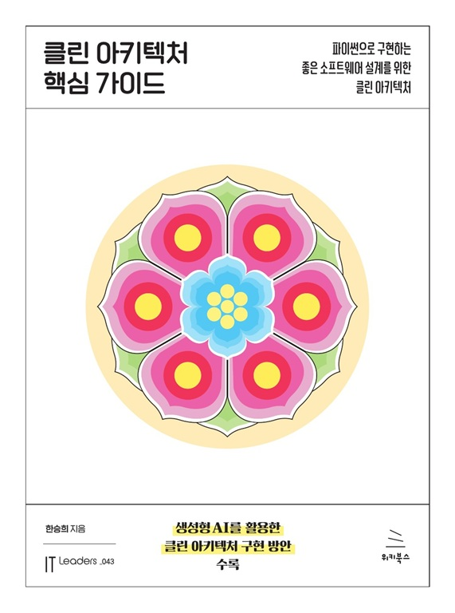

# 클린 아키텍처 핵심 가이드
### 파이썬으로 구현하는 좋은 소프트웨어 설계를 위한 클린 아키텍처

- **한승희** 지음
- ISBN: 9791158396565
- 판형: 175\*235\*15mm
- 28,000원 | 2026년 1월 12일 발행 | 368쪽
- [책 홈페이지](https://wikibook.co.kr/clean-architecture-guide/)
- [도서 미리보기]()
- [도서 관련 문의](https://wikibook.co.kr/support/contact/)

---

소프트웨어를 장기간 운영하고 개선하며 유지보수해본 개발자라면 코드 구조화의 중요성을 뼈저리게 느낀다. 동료가 쉽게 이해하고, 테스트가 용이하며, 변경에 강건한 코드는 단순히 기능이 동작하는 수준을 훨씬 넘어선다. 요즘처럼 생성형 AI로 코드를 빠르게 찍어낼 수 있는 시대에도 초기 구현 단계에서는 구조가 다소 느슨해도 동작은 하지만 실제 서비스로 출시하고 수년간 운영하려면 철저한 구조화 없이는 불가능하다.

《클린 아키텍처 핵심 가이드》는 장기 유지보수성과 비즈니스 민첩성을 동시에 확보하는 소프트웨어 설계의 본질을 다룬다. 로버트 C. 마틴의 클린 아키텍처를 중심축으로 삼아 이론 설명에 그치지 않고, 실무에서 바로 적용 가능한 풍부한 코드 예제를 제시하며 아키텍처 원칙을 구체적으로 구현하는 방법을 보여준다.

이 책을 읽으면 소프트웨어가 단순히 ‘동작하는 코드’가 아니라 비즈니스 목표와 요구 속성을 명확히 반영해야 하는 산물이며, 동시에 팀원 간 협업과 소통의 핵심 언어라는 점을 깨닫게 된다. 그동안 추상적으로만 느껴졌던 아키텍처 이론이 실제 코드와 함께 제시되면서 직관적으로 이해되고, 바로 자신의 프로젝트에 적용할 수 있는 수준으로 내면화된다.

특히 생성형 AI를 적극 활용하는 현재 개발 환경에서, 왜 개발자가 여전히 구조화를 주도해야 하는지, AI를 단순한 코드 생성기가 아닌 고품질 아키텍처를 만드는 강력한 조력자로 활용하는 방법까지 명확히 제시한다. 이 책은 클린 아키텍처를 배우는 데 그치지 않고, AI 시대에 개발자가 반드시 갖춰야 할 설계 감각과 실무 역량을 한 단계 끌어올리는 실질적인 지침서다.

**★ 이 책에서 다루는 내용 ★**

- 좋은 소프트웨어 설계의 본질과 필요성
- 설계에 필수적인 소프트웨어 핵심 개념
- 클린 아키텍처 이론과 실무 수준의 코드 예제
- 실제 애플리케이션 구현 과정을 통해 배우는 설계 원칙 적용 노하우
- 도메인 중심 설계 등 현대 소프트웨어 설계 패러다임의 이해
- 생성형 AI를 활용한 고품질 소프트웨어 설계 및 개발 기법

---
 
 ## 구입처
 
 - [예스24](https://www.yes24.com/product/goods/171028674)
 - [교보문고](https://product.kyobobook.co.kr/detail/S000218913876)
 - [알라딘]()
 - [쿠팡](https://www.coupang.com/vp/products/9268443731?itemId=27429191997)
